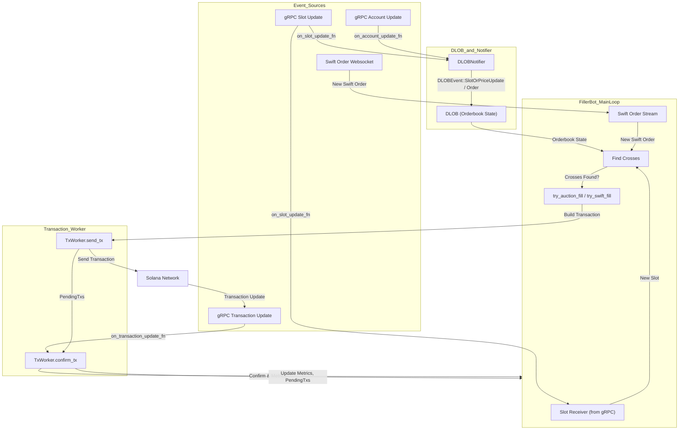
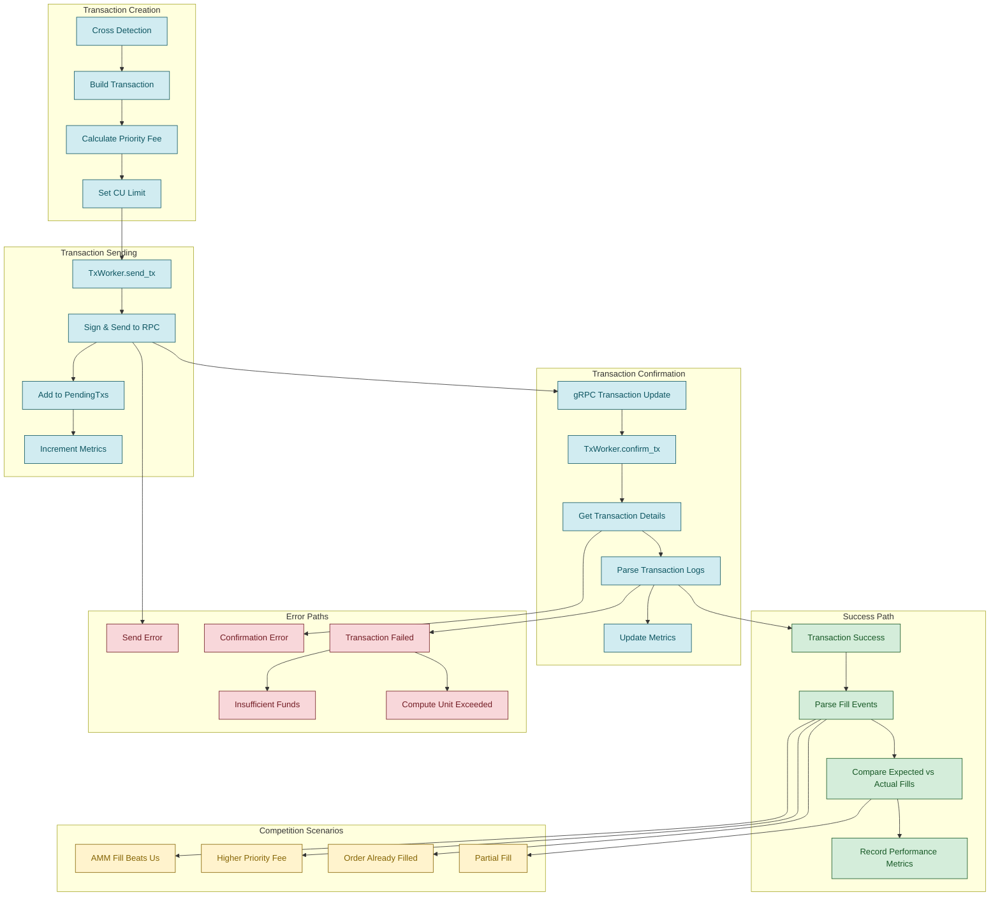

# Rust Keeper Bots
Example rust keeper bots

## Configuration

Copy `.env.example` to `.env` and substitute valid RPC credentials:

Required environment variables:
- `BOT_PRIVATE_KEY` - Base58 encoded private key
- `RPC_URL` - Solana RPC endpoint
- `GRPC_ENDPOINT` - Drift gRPC endpoint
- `GRPC_X_TOKEN` - Authentication token for gRPC
~- `PYTH_LAZER_TOKEN` - Pyth price feed access token~

## Run Perp Filler
The perp filler matches swift orders and onchain auction orders against resting liquidity.
It also attempts to uncross resting limit orders.

```shell
RUST_LOG=filler=info,dlob=info,swift=info \
    cargo run --release -- --mainnet --filler
```

- use `--dry` flag for tx simulation only

## Run 'Perp With Fill' Liquidator
Liquidator bot attemps to close liquidatable perp positions against resting limit orders and spot borrows with atomic swaps.

```shell
RUST_LOG=liquidator=info,dlob=info,swift=info \
    cargo run --release -- --mainnet --liquidator
```

## Event Flow Diagram

The following diagram illustrates the flow of events in the Filler Bot, from receiving gRPC and websocket events, updating the orderbook (DLOB), to sending and confirming transactions:



## Transaction Lifecycle Diagram

The following diagram shows the complete lifecycle of a transaction from creation to confirmation, including error handling and competition scenarios:



## Tx Summary
print some recent tx stats
```bash
 RUST_LOG=info cargo run --release --bin=tx_history <PUBKEY> --rpc-url <RPC_URL>
 ```
