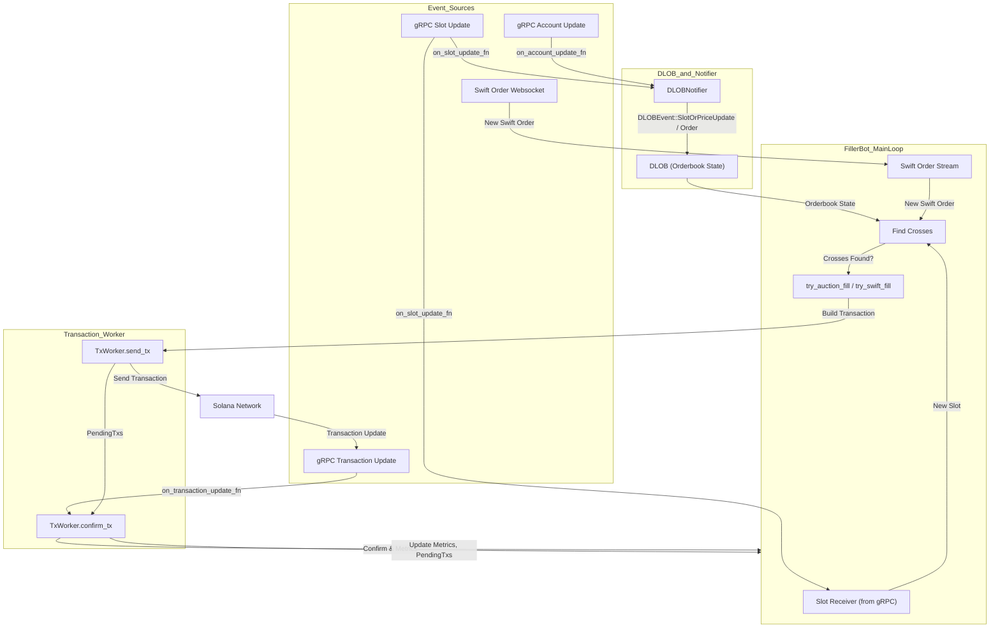

## Run Filler

```shell
BOT_PRIVATE_KEY="...." \
GRPC_X_TOKEN="aabbccddeeff0011223344" \
RPC_URL="https://api.rpcpool.com/...." \
RUST_LOG=filler=info,dlob=info,swift=info \
cargo run --release -- --mainnet
```

## Event Flow Diagram

The following diagram illustrates the flow of events in the Filler Bot, from receiving gRPC and websocket events, updating the orderbook (DLOB), to sending and confirming transactions:

