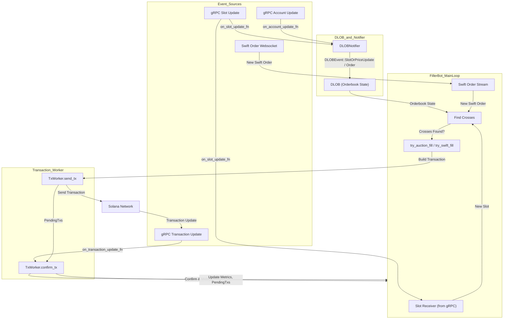
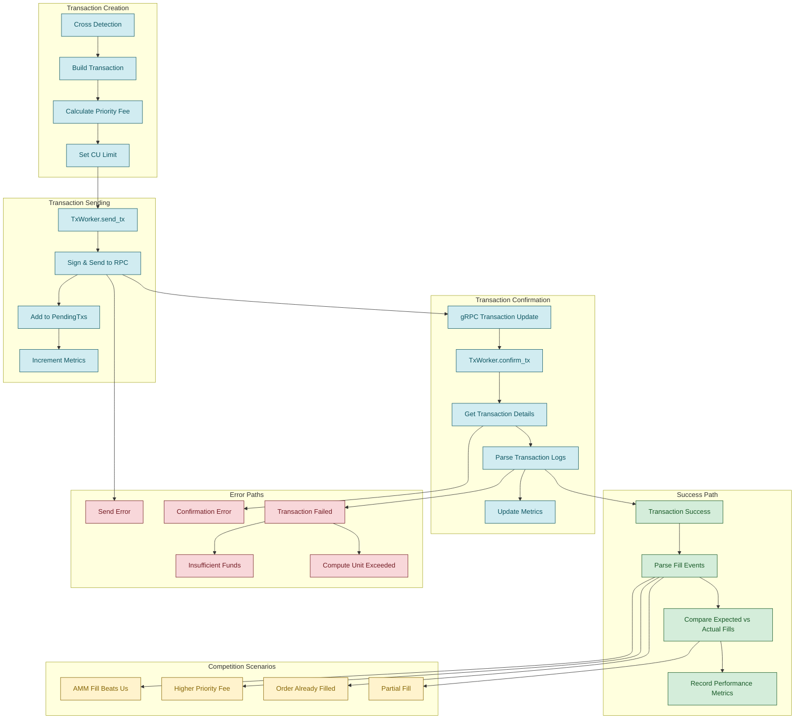

## Run Filler

```shell
BOT_PRIVATE_KEY="...." \
GRPC_X_TOKEN="aabbccddeeff0011223344" \
RPC_URL="https://api.rpcpool.com/...." \
RUST_LOG=filler=info,dlob=info,swift=info \
cargo run --release -- --mainnet
```

## Event Flow Diagram

The following diagram illustrates the flow of events in the Filler Bot, from receiving gRPC and websocket events, updating the orderbook (DLOB), to sending and confirming transactions:



## Transaction Lifecycle Diagram

The following diagram shows the complete lifecycle of a transaction from creation to confirmation, including error handling and competition scenarios:



## TODO:
- [x] increase memory for rust-filler pod

- [x] increase CU limit for place swift order
- [x] add athena queries to dashboard to track volume, maybe metrics. fills by market?
- [x] add vamm price to DLOB, prevent some wasted orders
- [x] add top makers to cross info
- [ ] improve metrics so its presentable
- [ ] swift tx retry on error
- [ ] consider VAMM order size?
- [ ] safe trigger orders
- [ ] check PMM orders (MT filler)
- [ ] use internal endpoint for swift order stream
- [ ] add swift orders to auctions immediately? (MT filler)

- [ ] rayon: parallelize the orderbook updates on new slot

## Tx Summary
print some recent tx stats
```bash
 RUST_LOG=info cargo run --release --bin=tx_history F1RsRqBjuLdGeKtQK2LEjVJHJqVbhBYtfUzaUCi8PcFv --rpc-url <RPC_URL>
 ```

## order does not exist examples
example: beaten by AMM fill ~5 slots earlier
 - https://solscan.io/tx/2jme1XL7WqTTVcKgjydozCw5gX441pSba1ptTr6DxtddrR9hPLX6SF4MUzd7VG7uTRs4uL2VavF8MRg8ptzS4By5
 - https://solscan.io/tx/43hfKyZXBvxRL4tcPdhCDUwBxLbriqEjRCUGMeSgNto7oiWyMuaJXdpqZU5qCJNcjvzzr7j9YUpjEDdavyHXAnks

example: beaten by AMM fill 1 slot earlier
toid: 3402
slot: 349335921
- us: https://solscan.io/tx/2An2tBXauLebwJbtg5a57W7BxbnkWyQBNAw4b4NcGy1fFyosV1JvoN6WDh472xHkRDUdE65C8aZvb3dkoPRbWDPq
- them: https://solscan.io/tx/5ry63m59ouJykrZBFmJHhvgrgdishEZFSUyK6gBd1M7AXDi4WUmjNqm7nD2jxQ2pr5Cb5p92rr7gsuFZKapP8sgJ

example: beaten by AMM fill 2 slots earlier
toid: 487
slot: 349336219
them slot: 349336217
us: https://solscan.io/tx/61sdUnbQTQk4KFzFn4Bt4gZ1XmYZErJdkex1RhRam34EoaKXb6D1uLSGcpheh96JSzGEsjDxk26oyYwVujfv1z7K
them: https://solscan.io/tx/wpzZePXNeTXaAFck1812S9GoFMN6Xr5kzi95GUfTLfqFjfxFofS8rrxRBWBijautcaE8u8r3TmpHLe1DdsnA5zL

seems in this case the order still seems live even though it filled.

toid: 259204
us: https://solscan.io/tx/2CbAQexzrHMZeE6pf9LbgAVNMi1m72Ys3A4NT7tdyLjoi1SQ2yWq5BfkA7FNUXnDsm3JVjS5yNqGDSFrLX73fnbt
349337367

AMM fill same slot
- https://solscan.io/tx/GfdeFh5n1vKdBdVtWqZzhAR1uL33kL6tP3Weju3R3Kwy2LVngJSABEtv9c7PkKjrhsF1rB7nPYqcdN49vatbBFQ
- https://solscan.io/tx/3jsjb25fPrENzFfGMFBps9VGNX2XKecxWLBSP7vPLjWXqkSfzPDjHtdy6T2om1mqkpFGvTfbm8VXRDo2LS6Qsd98
they have slightly higher fee:
- ours:   0.000005
- theirs: 0.000005882
- signer: 5r27HEM1Q9aXmy7MSD3HYJTGVKGmLTDa2q3c7hgJgj9b

toid: 1532
AMM fill same slot
- us: https://solscan.io/tx/5a6r6upr9Lm1N5AsxCpb5ZuNrM6YqoyHapHhPAM53WDRey1RpeEJ1QXqKCpS6eSV7fAnex1tpAvfQNf9kiRZUmSy
- them: https://solscan.io/tx/MguGhkkJHQEMAdLriHmPhkVCNEqVeJDvFXtx34xGQ1wU6pfnUViLaEUk8Sj6RSr7Pyy93YL9V1Q5PLJJSHvPB1e

they have slightly higher fee:
- ours:   0.000005
- theirs: 0.000005979
- signer: 5r27HEM1Q9aXmy7MSD3HYJTGVKGmLTDa2q3c7hgJgj9b
